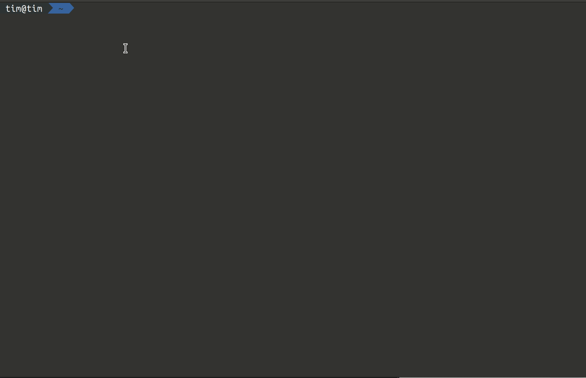

# Write My Cover Letter

### [https://github.com/timoshishi/write-my-cover-letter](https://github.com/timoshishi/write-my-cover-letter)

This is a script to aid writing personalized cover letters in .docx or .pdf format to your disk.

Notes:

PDF format is currently only supported if libreoffice is installed locally.

_You many need to make your terminal a little wider than usual to get the full experience._

## Installation

#### Run it once

`npx write-my-cover-letter`

#### Install globally

`npm install -g write-my-cover-letter`

- Run by typing `coverletter` in your terminal
- Writes to your present working directory

## Alternate Installation

Clone project from github

1. `git clone https://github.com/timoshishi/write-my-cover-letter.git`

2. `cd write-my-cover-letter`

3. `yarn install`

There are several scripts that can be run from the project root directory but you are likely just served by running
`yarn run build`. This is a development build made with rollup and will start the script in your terminal immediately.

## Usage

1. `coverletter` in your terminal will take you to a series of prompts.

2. You can go with the defaults or enter your own values. Running with the defaults the first time may give you a feel
   for the tone of the amazing cover letter you will be building.

- If you want to go back to using the defaults you will need to reinstall the package.

## Structure of the Cover Letter

- Intro
- A few sentences encapsulating your interest and some knowledge of the company wrapped up with a sentence about the
  position you are applying for with relevant skills listed.

- A paragraph describing a recent project you have worked on. This has options for Full Stack, Front End and Back End.
  These paragraphs are selected in the prompt process.

- A paragraph speaking as to why you are an amazing person to work with and the values you hold dear.

- Closing that includes your name, your sites and contact information.

## Running Tests

- `npm run test`

### Frequently Asked Questions that haven't been asked

**Q: Why is this a thing?**

**A**: I was tired of writing cover letters and wanted to make a fun little script to automate the process.

**Q: Do you use this?**

**A:** Definitely not. If I am interested in a company I will write a cover letter by hand.

**Q: Is this going to help me get a job?**

**A:** This is highly dependent on your skills and experience. This is a tool to help you write a cover letter that is
personalized to the company you are applying to. It is not a magic bullet.

**Q: How can I personalize Write my Cover Letter for myself?**

**A:** You can fork the project and make changes to the text in the `src/constants/index.ts` files.

**_Good luck!_**
